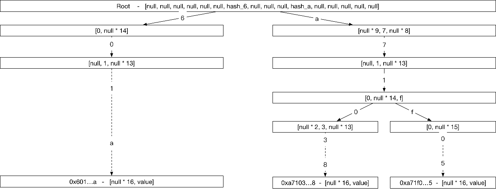
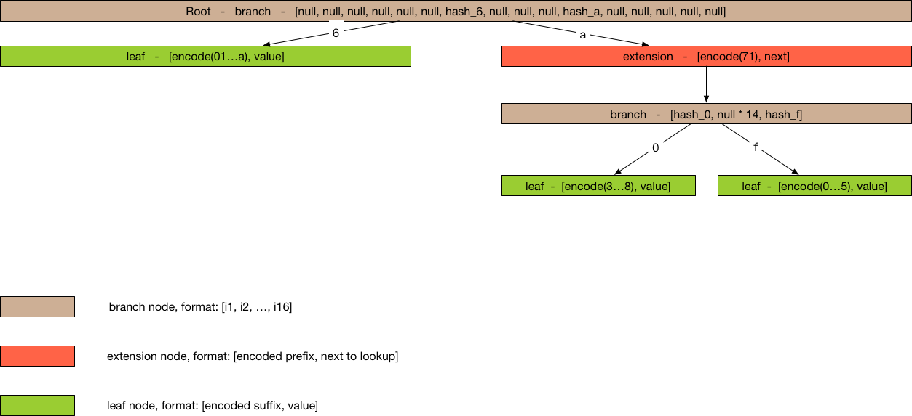

# Merkle Patricia Tree

## Basic: Radix Tree

> Reference: [https://en.wikipedia.org/wiki/Radix\_tree](https://en.wikipedia.org/wiki/Radix_tree)

A Radix Tree using address as the key looks like below:

* Addresses are represented as Hex Characters
* Each node in the Tree is a 16-elements array,  16 branch-slots\(0123...def\)
* leaf node: value can be any binary data carried by the address
* non-leaf node: value is the hash value calculated based on the children’s data

As for a 160-bits address, the max height of the tree is 40

**Problems:** much space for a single entry 40 steps for each lookup

## Advanced: Merkle Patricia Tree

> Reference: [https://github.com/ethereum/wiki/wiki/Patricia-Tree](https://github.com/ethereum/wiki/wiki/Patricia-Tree), [http://gavwood.com/Paper.pdf](http://gavwood.com/Paper.pdf)

In order to reduce the storage of Radix Tree. The nodes in Merkle Patricia Tree are divided into three kinds,

* extension node: compress nodes using common prefix
* leaf node: compress nodes using unique suffix
* branch node: same as node in Radix Tree

## How to store Merkle Patricia Tree

**Key/Value Storage**

hash\(value\) = sha3\(serialize\(value\)\)

key = hash\(value\)

## How to update Merkle Patricia Tree

**Query**

DFS from top to bottom

**Update, Delete or Insert**

1.Query the node from top to bottom

2.update the hash along the path from bottom to top

**Performance** Each operation costs O\(log\(n\)\)

## How to verify using Merkle Patricia Tree

**Theorems**

1.Same merkle trees must have same root hash.

2.Different merkle trees must have different root hash.

Using the theorems, we can verify the result of the execution of transactions.

**Quick Verification**

A light client, without sync huge transactions, can immediately determine the exact balance and status of any account by simply asking the network for a path from the root to the account node.

